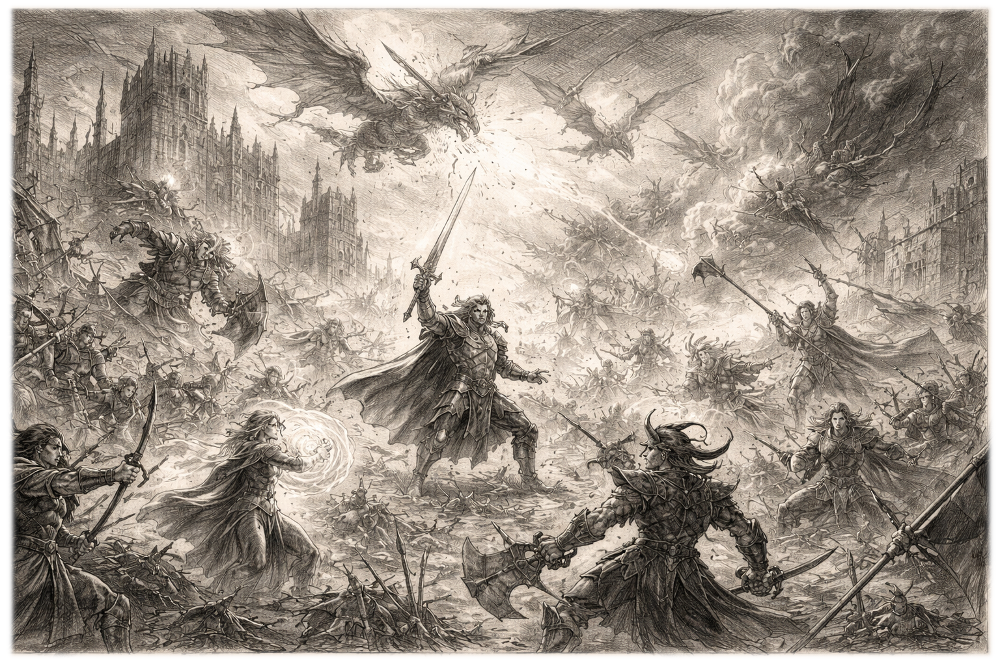
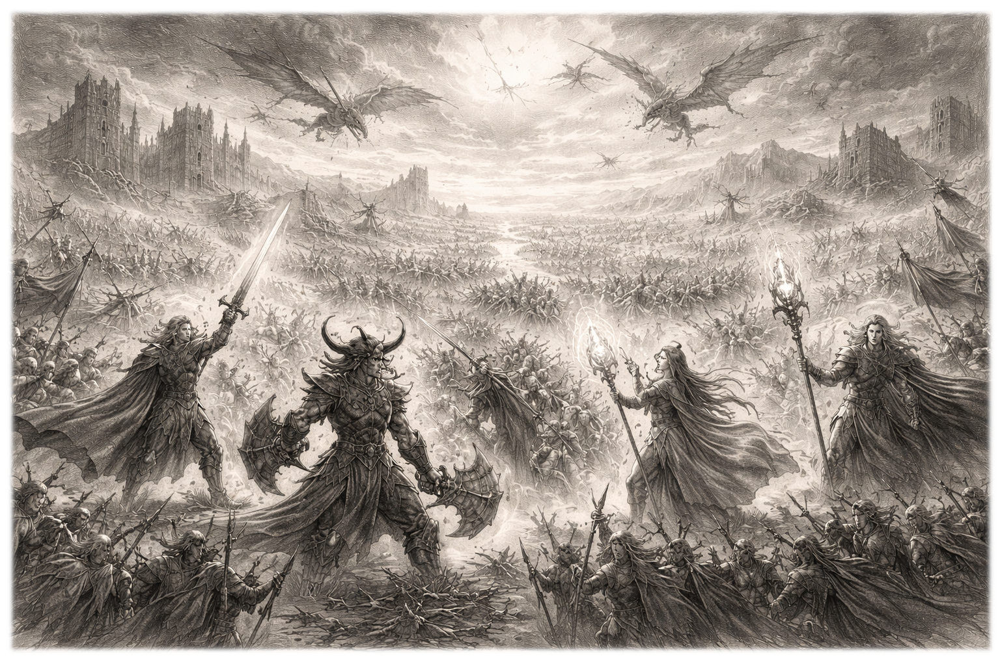
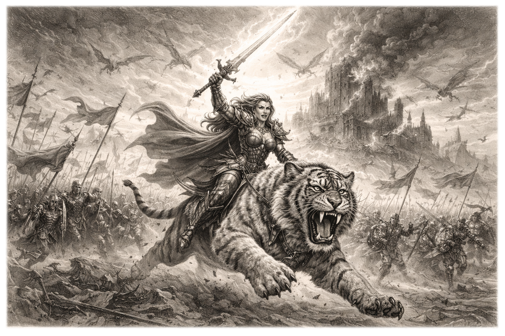
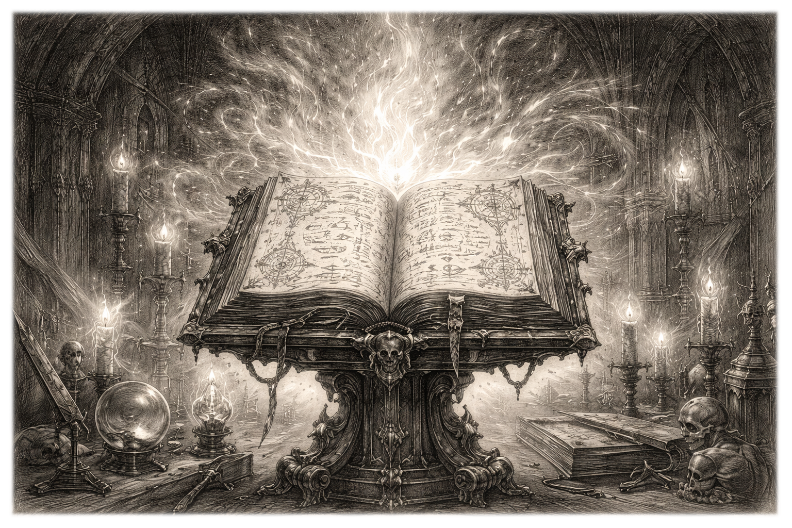

# **Tier-Z - un formato di gioco narrativo per MtG**

Autore: Guido Cauli \<guido.cauli@gmail.com\>  
Ultimo aggiornamento: 19/04/2026  
Documento bozza versione 1.3.3

MtG Tier-Z è un formato multiplayer di MtG strettamente non competitivo derivato dal formato Commander e progettato per:

* incentivare la socialità e l’interazione tra giocatori  
* favorire partite narrative e memorabili  
* ridurre l’ottimizzazione parossistica dei mazzi  
* eliminare strategie non interattive o oppressive

Il formato privilegia il divertimento condiviso rispetto alla competitività.  
I principi fondamentali sono: **non-determinismo, economicità, narrativa**.

## ***Principio base di non-determinismo***  ***(“Regola Zero”)***

Un gameplay è considerato *deterministico* quando, a partire da una certa posizione di gioco, un giocatore può eseguire in maniera sistematica una sequenza di azioni prevedibile e solidamente ripetibile, che porti a un risultato ottimale con minima o nulla interazione significativa da parte degli avversari.

Questo si può tradurre con la restrizione di:

* sequenze di gioco predefinite e lineari  
* situazioni in cui le scelte diventano automatiche o obbligate  
* riduzione significativa della varianza e dell’imprevedibilità  
* turni prolungati in cui un solo giocatore esegue molte azioni senza reale opposizione

In Tier-Z una tipologia di gameplay esclusivamente e palesemente deterministica è considerata non valida.

## ***Regole Base***

Si applicano tutte le regole del formato Commander ufficiale, con le seguenti modifiche e integrazioni.

### **Regole di Deckbuilding**

#### 1\. Combo infinite di due carte e loop degenerativi

Non sono ammesse:

* Combo infinite, ovvero sequenze di interazioni che generano un effetto ripetibile indefinitamente senza ulteriore investimento significativo di risorse  
* Combo di due carte che producano condizioni di vittoria alternative istantanee  
* Loop degenerativi deterministici o virtualmente infiniti, cioè combinazioni reiterabili più volte nello stesso turno o in più turni che producano un vantaggio proporzionalmente maggiore (danno, mana, pescate, turni extra)  
* *Hard lock*, ovvero situazioni in cui uno o più giocatori non possano più partecipare in modo significativo alla partita.

#### 2\. Rimozioni e bounce di massa asimmetrici

Non sono ammesse carte o effetti diretti che colpiscono simultaneamente tutti gli avversari in modo esclusivo e indiscriminato, senza coinvolgere in modo comparabile il controllore.

Esempi di effetti vietati:  
“*ogni avversario sacrifica tutte le creature…*”  
“*fai ritornare tutti i permanenti degli avversari…*”

Sono invece consentiti:

* effetti simmetrici (es. carte che dicono “distruggi tutte le creature”)  
* effetti che coinvolgono anche il controllore in modo comparabile

#### 3\. Tutori diretti

Non sono ammesse carte non-creatura il cui effetto principale consista nel cercare una o più carte non terra specifiche all’interno del proprio grimorio e aggiungerle direttamente alla propria mano o metterle sul campo di battaglia.

Sono consentiti:

* effetti casuali o non deterministici  
* carte con tutoring secondario o condizionale  
* meccaniche tipo “impulso”, “reveal”, “discover”,”cascade”

#### 4\. Effetti “tassa” asimmetrici

Non sono ammesse carte o abilità che impongono in modo automatico e/o ripetitivo un costo aggiuntivo o una penalità verso tutti gli avversari simultaneamente per compiere azioni fondamentali di gioco, come:

* lanciare magie e/o giocare terre  
* poter attaccare almeno un altro giocatore in una partita a più giocatori  
* pescare carte  
* attivare abilità

Definizione:  
*Un effetto “tassa” è qualsiasi abilità che forza ogni avversario simultaneamente a pagare risorse aggiuntive o subire una penalità sistematica, automatica e ripetuta per poter compiere azioni fondamentali.*

Sono quindi vietati:

* effetti stile Studio Ristico  
* effetti stile Dilemma Doloroso  
* carte che impongono costi aggiuntivi globali o continui agli avversari

Sono invece consentiti:

* effetti one-shot (es. tassa singola temporanea)  
* Effetti come Propaganda o Prigione Spettrale, perché non impediscono al giocatore di turno di attaccare tutti gli altri giocatori, ma sono il controllore di tale effetto   
* effetti situazionali o non ripetibili  
* interazioni che richiedono scelte attive ma non sistematicamente oppressive nel lungo periodo

#### 5\. Turni Extra

Non sono ammesse carte o interazioni che concedono turni extra in modo ripetibile o abusabile.

Definizione:  
*Un effetto di turno extra è considerato non conforme se permette a un giocatore di ottenere più turni consecutivi o multipli nel corso della partita con bassa interazione o elevata consistenza.*

Sono quindi vietate:

* catene di turni extra (anche se non infinite)  
* combinazioni che permettano di “prendere il controllo” della partita per più turni consecutivi e/o che possano essere facilmente riciclati (es. tramite recursion o copie)

Sono invece consentiti:

* effetti di turno extra singoli e isolati, non facilmente recuperabili  
* carte che generano un turno extra come evento raro o non ripetibile.

Regola generale:   
*se un effetto di turno extra può essere riutilizzato più di una volta nella stessa partita con ragionevole consistenza, è da considerarsi vietato.*

### **Regola del mulligan**

All'inizio della partita, ad ogni giocatore sono concessi 2 mulligan gratuiti.  
Dal terzo mulligan si applica la regola standard del London Mulligan.

## ***Budget generale del mazzo***  ***(principio di economicità)***

Il costo massimo del mazzo non deve superare i 100€ o 130USD, mentre il costo massimo per una singola carta del mazzo non deve superare 10€ o 13 USD.

Riferimento prezzi:  
Scryfall, Moxfield o comunque prezzo medio su Cardmarket degli ultimi 7 giorni, considerando la versione non-foil e più economica disponibile della carta.  
Eventuali discrepanze vanno risolte consensualmente tra i giocatori.

## ***Regole per la componente narrativa***

In caso di dubbi, si applica il seguente principio:  
*Se una carta, un effetto o una forma di interazione impiegate in maniera sistematica e ripetitiva riducono significativamente l’interazione tra giocatori o rende la partita non partecipativa, è da considerarsi non conforme allo spirito del formato.*   
*La valutazione finale spetta sempre al tavolo.*

### **Il comandante** 

Il comandante è una figura chiave nel gioco narrativo in formato Tier-Z.  
Al regolamento di Commander vengono applicate le seguenti modifiche:
***
**Benedizione del Campione**: una volta per turno, se il comandante diventa bersaglio di una magia o abilità avversaria, il suo controllore può pagare 3 punti vita. Se lo fa, quel comandante viene TAPpato e guadagna velo fino alla fine del turno. Questo effetto è da considerarsi alla stregua di un'abilità attivata e utilizza la pila.
***
**Presenza del Campione**: una sola volta per turno, quando un comandante entra nel campo di battaglia dalla zona di comando, se il giocatore che lo evoca controlla almeno un'altra creatura, quel giocatore può scegliere e attivare uno dei seguenti effetti:

* Aggiunge una carta dalla cima del deck alla mano  
* Guadagna 3 punti vita  
* STAPpa fino a due terre base

Questo effetto è da considerarsi alla stregua di un'abilità innescata e utilizza la pila.
***
**Requiem del Campione**: una sola volta per turno, quando un comandante lascia il campo di battaglia, se il giocatore che controllava quel comandante controlla almeno un’altra creatura sul campo di battaglia, quel giocatore deve scegliere e attivare uno dei seguenti effetti: 

* Una creatura che controlla prende \-2/-0 fino alle fine del turno  
* Sceglie una carta dalla propria mano e la mette in cima al proprio deck   
* Perde 3 punti vita

Questo effetto è da considerarsi alla stregua di un'abilità innescata e utilizza la pila.
***
**Danno da comandante**: in Tier-Z il concetto di “danno da comandante” non si applica.

  

### **Regola opzionale: Momento Epico**

Una volta per partita, ciascun giocatore può annunciare le azioni da compiere in uno dei propri turni dichiarandole come Momento Epico. 
I turni definiti come Momento Epico devono includere interazioni significative con altri giocatori e/o azioni mirate a cambiare profondamente gli equilibri di gioco. 
Una volta dichiarato il Momento Epico, il giocatore di turno descrive i dettagli delle sue azioni e soprattutto dichiara al tavolo la previsione del risultato che intende ottenere. 

Le azioni dichiarate dal giocatore di turno vengono effettuate come di consueto e in base all'esito si determina: 
***
* **Successo totale**: l'azione è riuscita esattamente come dichiarato. Alla fine del turno, il giocatore ottiene un bonus a scelta tra i seguenti:  
  * STAPpa fino a tre terre che controlla  
  * STAPpa fino a due creature che controlla   
  * Guadagna 5 punti vita  
  * Aggiunge una carta dalla cima del deck alla propria mano  
* **Successo parziale**: l'azione è riuscita parzialmente rispetto a quanto dichiarato. Alla fine del turno, il giocatore ottiene un bonus a scelta:  
  * STAPpa fino a due terre base che controlla  
  * Strappa fino a una creatura con forza pari a 2 o inferiore  
  * Guadagna 2 punti vita  
* **Fallimento**: l'azione non è riuscita, è stata totalmente neutralizzata o non ha sortito alcun effetto dichiarato. Alla fine del turno, il giocatore ottiene una penalità a scelta tra:  
  * Sacrifica una creatura non pedina   
  * Sacrifica due terre   
  * Esilia una carta non terra dalla mano.
***

Le azioni effettuate in seguito agli esiti del Momento Epico non vanno in pila, sono trattate alla stregua di azioni generate dallo stato e sono effettuate durante la sottofase di cancellazione. Eventuali effetti generati vanno in pila al termine della sottofase di cancellazione (vedi regole 514.2 e 514.3a).

### **Regola opzionale: Grimorio dei Trucchetti (cantrips)**

Questa regola prevede di giocare con un deck aggiuntivo, comune a tutti i giocatori del tavolo, formato da “trucchetti”, da 30 carte totali.

Definizione:  
per “trucchetti” (cantrips) si intendono carte Istantaneo o Stregoneria con costo di mana convertito pari a 1, con un valore economico pari o inferiore a 1 Euro (1,3 USD) per carta (vedi paragrafo Budget Generale del Mazzo), che abbiano effetti “lievi” sul campo, come:

* pescare una carta  
* far scartare una carta  
* bersagliare fino a una singola creatura sul campo di battaglia (rimozioni, rimbalzi o bonus/malus con modifiche massime pari a \+3/+3 o \-3/-3 e solo se fino alla fine del turno)

Ogni giocatore, una sola volta per turno all’inizio della propria fase principale pre-combattimento, può guardare la carta in cima a questo deck pagando 3 punti vita. Dopodiché può decidere se aggiungerla alla propria mano o metterla in fondo al Grimorio dei Trucchetti. 

Una carta del Grimorio dei Trucchetti può essere utilizzata pagando mana di qualsiasi colore per lanciarla. Quando una carta del Grimorio dei Trucchetti viene messa in un cimitero dal gioco, viene invece messa in fondo al Grimorio dei Trucchetti.

## ***Lista provvisoria delle carte bandite (v1.2.1)***

Oltre alle carte già presenti della [banned list di Commander](https://mtgcommander.net/index.php/banned-list/), le seguenti carte non possono essere utilizzate in Tier-Z:

Thassa's Oracle  
Demonic Consultation  
Tainted Pact  
Isochron Scepter  
Chord of Calling  
Dramatic Reversal  
Underworld Breach  
Stasis  
Winter Orb  
Static Orb  
Knowledge Pool  
Drannith Magistrate  
Rhystic Study  
Smothering Tithe  
Mystic Remora  
Esper Sentinel  
Painful Quandary  
Protean Hulk  
Demonic Tutor  
Vampiric Tutor  
Enlightened Tutor  
Worldly Tutor  
Mystical Tutor  
Imperial Seal  
Cyclonic Rift  
Farewell  
Opposition Agent  
Stuffy Doll  
Toxic Deluge  
Time Warp  
Temporal Manipulation  
Nexus of Fate  
Expropriate  
Emeritus of Woe  

### **Watch list provvisoria v1.2** 

(carte da monitorare, non bandite ma da considerare caso per caso)

Ophidian Eye  
Curiosity  
Tandem Lookout  
Dockside Extortionist  
Storm-Kiln Artist  
Birgi, God of Storytelling  
Future Sight  
Mystic Forge  
Bolas's Citadel  
Aetherflux Reservoir  
Mind's Desire  
Narset, Parter of Veils  
Teferi's Protection
